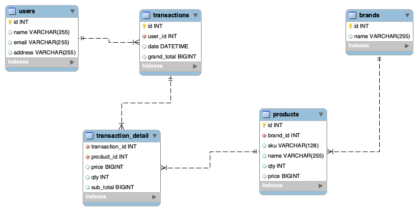

# Kuncie Backend Test

## BE Candidate Take Home Test

Have you shopped online? Let’s imagine that you need to build the checkout backend service that will support different promotions with the given inventory.
Build a checkout system with these items:

| SKU | Name | Price | Qty |
|-----|------|-------|-----|
| 123 |Google Home|$49.99|10|
| 234 |Macbook Pro|$5,399.99|5|
| 456 |Alexa Speaker|$109.50|10|
| 984 |Raspi B|$30.00|2|

The system should have the following promotions:
- Each sale of a MacBook Pro comes with a free Raspberry Pi B
- Buy 3 Google Homes for the price of 2
- Buying more than 3 Alexa Speakers will have a 10% discount on all Alexa speakers

Example Scenarios:
- Scanned Items: MacBook Pro, Raspberry Pi B Total: $5,399.99
- Scanned Items: Google Home, Google Home, Google Home Total: $99.98
- Scanned Items: Alexa Speaker, Alexa Speaker, Alexa Speaker Total: $295.65

***Task***
1. Please write it in Golang or Node with a CI script that runs tests and produces a binary.
2. Finally, imagine that adding items to cart and checking out was a backend API. Please design a schema file for GraphQL on how you would do this.
3. Thank you for your time and we look forward to reviewing your solution. If you have any questions, please feel free to contact us. Please send us a link to your git repo.

# Solution

## Database Schema


## Building and Running The App

Prerequisites:

1. Go 1.16
2. Docker
3. Docker Compose
4. Golang migrate (https://github.com/golang-migrate/migrate)

The App is separate into three services, User service, Product service, Transaction service but in one App

**Step 1 Checkout**

```bash
$ git clone https://github.com/arieffian/kuncie-backend-test.git
$ cd kuncie-backend-test
```

**Step 2 Start MySQL Service**

```bash
$ docker-compose up
```

**Step 3 Run Migration**

```bash
$ migrate -database mysql://backend:backend@/backend -path ./sql up
```

**Step 4 Calling APIs**

Create Brand
```bash
$ curl -X POST -H 'content-type: application/json' --data '{"name": "acer"}' http://localhost:8080/brand
``` 

Get Product by ID
```bash
$ curl http://localhost:8080/product?id=1
``` 

Create Product
```bash
$ curl -X POST -H 'content-type: application/json' --data '{"brand_id": 4, "name": "predator", "qty": 3, "price": 1050}' http://localhost:8080/product
``` 

Get Product by Brand ID
```bash
$ curl http://localhost:8080/product/brand?id=1
``` 

Create Transaction
```bash
$ curl -X POST -H 'content-type: application/json' --data '{"user_id": 1,"detail": [{"product_id": 1,"qty": 1},{"product_id": 2,"qty": 1},{"product_id": 3,"qty": 1}]}' http://localhost:8080/order
``` 

Get Transaction by ID
```bash
$ curl http://localhost:8080/order?id=1
``` 

## Testing App

```bash
$ go test ./... -cover -vet -all -v
``` 

curl -X POST -H 'Content-Type: application/json' -d '{"query": "query { order { id,user_id,grand_total,detail_order{product_id,sub_total} } }"}' http://localhost:8080/
